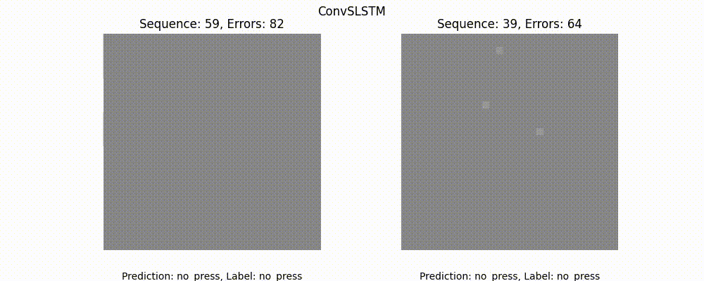

# Visual Tactile Sensing with Event Cameras using Spiking Neural Networks
This repository experiments with different methods for tactile sensing using event cameras and spiking neural networks.

<div align="center">
  
</div>


## Table of Contents
1. [Usage](#usage)
2. [Training Models for Tactile Sensing](#training-models-for-tactile-sensing)
   - [Download Raw Data](#step-1-download-raw-data)
   - [Process Raw Data for Training](#step-2-process-raw-data-for-training)
   - [Train the Model](#step-3-train-the-model)
3. [Real-Time Inference](#real-time-inference)
   - [Running the Inference Server](#running-the-inference-server)
   - [Using the Interface](#using-the-interface)
   
## Usage

### 1. Clone the Repository
```bash
git clone https://github.com/khoavpt/Visual-Tactile-Sensing-with-Event-Cameras-using-Spiking-Neural-Networks.git
```

### 2. Install Dependencies
```bash
cd Visual-Tactile-Sensing-with-Event-Cameras-using-Spiking-Neural-Networks
conda env create -f snn_env.yaml
conda activate snn 
```

## Training Models for Tactile Sensing

### Step 1: Download Raw Data
Download raw AEDAT4 data from the provided [Google Drive link](https://drive.google.com/drive/folders/1Aac3Xi6cK6aUR3ELnsJXgvIMCjjYVNi0) and place it in the `data/raw_data` directory (`raw12.aedat4` hasn’t been labeled; remove it for now.).

### Step 2: Process Raw Data for Training
Convert the raw AEDAT4 data into sequences of frames and save them as `.pt` files:
```bash
python src/process_train_data.py
```

#### Configuration File
This script uses the configuration specified in `configs/data_module/data_cf.yaml`.

#### Customizable Data Processing Parameters
- `batch_size`: Batch size for data loading.
- `num_workers`: Number of worker threads for data loading.
- `frame_duration`: Duration of each frame in milliseconds.
- `encoding_type`: Encoding type (`accumulate`, `time_surface`, `custom`).
- `sequence_length`: Length of each sequence.
- `input_dir`: Directory containing raw AEDAT4 data.
- `output_dir`: Directory to save processed sequences.

#### Overriding Parameters
You can override parameters directly from the command line:
```bash
python src/process_train_data.py data_module.batch_size=64 data_module.input_dir=data/raw_data data_module.output_dir=data/seq_data_acc data_module.encoding_type=accumulate
```

### Step 3: Train the Model
After processing the data, train the model using `train.py` (training information is tracked using WandB, so basic WandB setup is required):
```bash
python src/train.py
```

This script uses the configuration specified in `configs/model`. You can switch between models and adjust hyperparameters as needed. The input data used for training is set using the arguments `data_module.output_dir`!

#### Switching Between Models
To switch between different models (e.g., ConvLSTM , ConvSNN), specify the model configuration in the command line:
```bash
python src/train.py model=convsnn_cf
```

#### Customizable Model Parameters
- **For ConvSNN:**
  - `feature_size`: Size of the feature vector.
  - `beta_init`: Initial beta value.
  - `spikegrad`: Surrogate gradient function (`fast_sigmoid`, `arctan`, `heaviside`).
  - `in_channels`: Number of input channels (`custom` encoding methods require 2 channels)

- **For ConvLSTM:**
  - `feature_size`: Size of the feature vector for LSTM
  - `in_channels`: Number of input channels (`custom` encoding methods require 2 channels)

- **For SpikingConvLSTM CBAM** (main)
  - `beta_init`: Initial beta value.
  - `spikegrad`: Surrogate gradient function (`fast_sigmoid`, `arctan`, `heaviside`).
  - ...

#### Customizable Trainer Parameters
- `max_epochs`: Maximum number of training epochs.
- `accelerator`: Hardware accelerator (`cpu`, `gpu`).

Example:
```bash
python src/train.py model=convsnn_cf data_module.output_dir=data/seq_data_acc model.lr=0.001
```

## Real-Time Inference 
The project includes a web-based interface for real-time tactile sensing using both live event camera feed and pre-recorded data.
<div align="center">
  
</div>

### Running the Inference Server
```bash
python src/inference_app/inference.py
```
This will start a Flask server on `http://localhost:5000`.

### Features
- **Multiple Model Support**: Switch between different trained models (ConvSNN, ConvSNN-L, Spiking ConvLSTM)
- **Dual Input Sources**: 
  - Live feed from DV event camera
  - Pre-recorded AEDAT4 files
- **Real-time Visualization**: View event camera output and predictions simultaneously
- **Low-latency Processing**: 30fps (customizable) processing with event-based encoding

### Using the Interface

### Step 1: Access the web interface
   - Open a browser and navigate to `http://localhost:5000`
   - Ensure your event camera is connected (if using live mode)

### Step 2: Select Input source and Model used
   - Choose between:
     - `Live Camera`: Direct feed from DV event camera
     - `Recorded Data`: Pre-recorded AEDAT4 files
   - Select a model checkpoint from the dropdown menu (trained model checkpoints need to be placed in the `saved_models` directory in the following format: ` {model_type}_{encoding_method}.ckpt ` 
   Example: `convsnnl_accumulate.ckpt`)

### Step 2: Start processing
   - Click "Start Processing" to begin inference
   - The interface will display:
     - Event camera visualization
     - Real-time tactile predictions (Press/No Press)